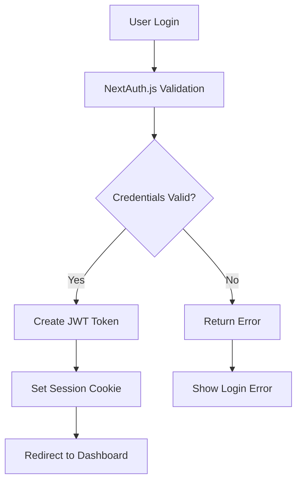
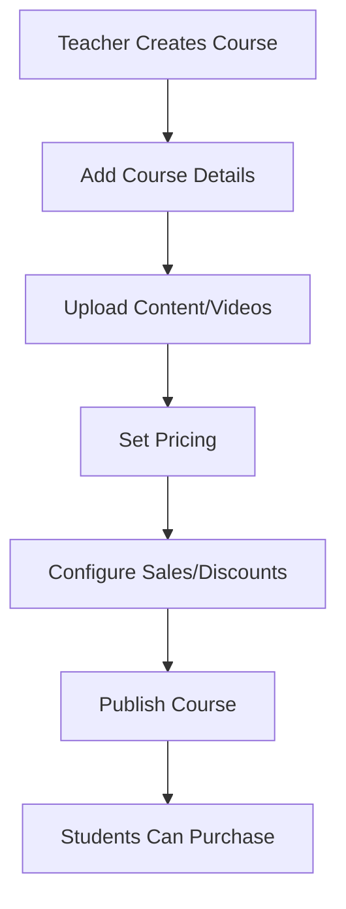
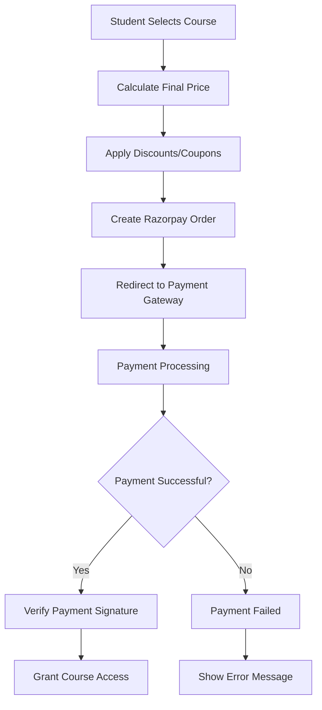
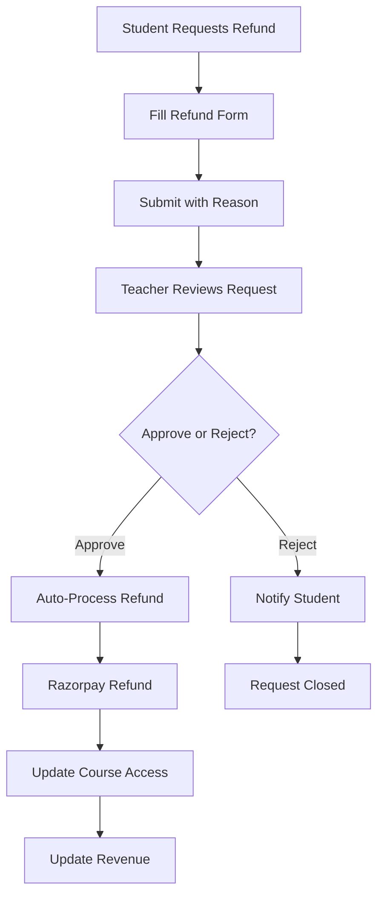
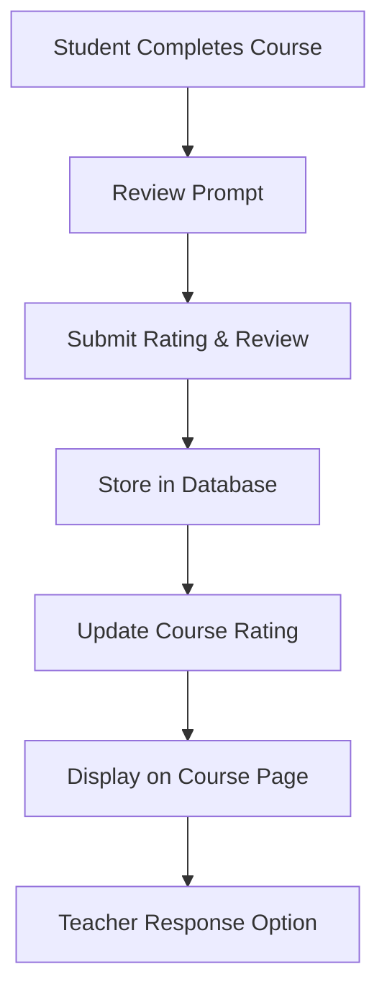

# EduLearn - Comprehensive Learning Management System

## 📋 Table of Contents
- [Project Overview](#project-overview)
- [Purpose & Vision](#purpose--vision)
- [Technology Stack](#technology-stack)
- [Project Architecture](#project-architecture)
- [Database Models](#database-models)
- [Authentication System](#authentication-system)
- [Course Management](#course-management)
- [Payment System](#payment-system)
- [Refund Management](#refund-management)
- [Sales & Discount System](#sales--discount-system)
- [Reviews & Rating System](#reviews--rating-system)
- [User Management](#user-management)
- [Admin Panel](#admin-panel)
- [API Endpoints](#api-endpoints)
- [Security Features](#security-features)
- [Installation & Setup](#installation--setup)

---

## 🎯 Project Overview

EduLearn is a full-featured Learning Management System (LMS) built with modern web technologies. It provides a comprehensive platform for online education, enabling seamless interaction between students, teachers, and administrators.

### Key Highlights
- **Role-Based Access Control**: Separate interfaces for Students, Teachers, and Admins
- **Secure Payment Processing**: Integrated with Razorpay for seamless transactions
- **Advanced Refund System**: Automated refund processing with approval workflows
- **Dynamic Pricing**: Sales, coupons, and discount management
- **Course Progress Tracking**: Real-time learning progress monitoring
- **Review & Rating System**: Community-driven course feedback

---

## 🎯 Purpose & Vision

### Primary Goals
1. **Democratize Education**: Make quality education accessible to everyone
2. **Empower Educators**: Provide tools for content creators to monetize their knowledge
3. **Seamless Learning Experience**: Offer intuitive interfaces for both learners and educators
4. **Financial Transparency**: Clear payment processing with robust refund policies

### Target Audience
- **Students**: Individuals seeking to learn new skills or advance their careers
- **Teachers/Instructors**: Subject matter experts wanting to create and sell courses
- **Educational Institutions**: Organizations looking to digitize their curriculum
- **Corporate Training**: Companies needing employee skill development solutions

---

## 🛠️ Technology Stack

### Frontend Technologies
```javascript
// Core Framework
- Next.js 14 (App Router)
- React 18
- TypeScript

// Styling & UI
- Tailwind CSS
- Shadcn/UI Components
- Lucide React Icons
- Radix UI Primitives

// State Management & Forms
- React Hook Form
- Zod Validation
- useState/useEffect hooks
```

### Backend Technologies
```javascript
// Runtime & Framework
- Node.js
- Next.js API Routes
- TypeScript

// Database & ODM
- MongoDB
- Mongoose ODM

// Authentication
- NextAuth.js
- JWT Tokens
- Session Management

// Payment Processing
- Razorpay SDK
- Webhook Handling
```

### Development Tools
```bash
# Package Management
- npm/yarn
- Package.json

# Code Quality
- ESLint
- Prettier
- TypeScript Compiler

# Environment Management
- dotenv
- Environment Variables
```

---

## 🏗️ Project Architecture

### Folder Structure Analysis
```
learning-management-system/
├── src/
│   ├── app/                     # Next.js App Router
│   │   ├── api/                 # Backend API Routes
│   │   │   ├── auth/           # Authentication endpoints
│   │   │   ├── courses/        # Course CRUD operations
│   │   │   ├── payments/       # Payment processing
│   │   │   ├── refunds/        # Refund management
│   │   │   ├── reviews/        # Review system
│   │   │   └── admin/          # Admin operations
│   │   ├── student/            # Student dashboard & pages
│   │   ├── teacher/            # Teacher dashboard & pages
│   │   ├── admin/              # Admin panel
│   │   └── refund/             # Refund processing UI
│   ├── components/             # Reusable UI components
│   │   ├── ui/                 # Base UI components
│   │   ├── animations/         # Animation components
│   ├── lib/                    # Utility libraries
│   │   ├── auth.ts            # Authentication config
│   │   ├── dbConnect.ts       # Database connection
│   │   └── utils.ts           # Helper functions
│   ├── models/                 # Mongoose models
│   │   ├── course.ts          # Course schema
│   │   ├── student.ts         # Student schema
│   │   ├── teacher.ts         # Teacher schema
│   │   ├── payment.ts         # Payment schema
│   │   ├── refund.ts          # Refund schema
│   │   ├── sales.ts           # Sales schema
│   │   ├── coupon.ts          # Coupon schema
│   │   └── request-refund.ts  # Refund request schema
│   └── types/                  # TypeScript definitions
├── public/                     # Static assets
└── configuration files         # Package.json, env, etc.
```

### Architecture Patterns
1. **MVC Pattern**: Model-View-Controller separation
2. **API-First Design**: RESTful API endpoints
3. **Component-Based UI**: Reusable React components
4. **Middleware Layer**: Authentication and validation middleware

---

## 🗃️ Database Models

### Core Models Overview

#### Student Model
```typescript
{
  name: String,                    // Full name
  email: String,                   // Unique email
  password: String,                // Hashed password
  role: "student",                 // User role
  purchasedCourses: [ObjectId],    // Array of course IDs
  profilePicture: String,          // Profile image URL
  createdAt: Date,
  updatedAt: Date
}
```

#### Teacher Model
```typescript
{
  name: String,                    // Full name
  email: String,                   // Unique email
  password: String,                // Hashed password
  role: "teacher",                 // User role
  bio: String,                     // Teacher biography
  expertise: [String],             // Areas of expertise
  socialLinks: Object,             // Social media links
  createdCourses: [ObjectId],      // Array of course IDs
  totalEarnings: Number,           // Revenue earned
  profilePicture: String,
  createdAt: Date,
  updatedAt: Date
}
```

#### Course Model
```typescript
{
  name: String,                    // Course title
  description: String,             // Course description
  price: Number,                   // Course price in INR
  teacher: ObjectId,               // Reference to teacher
  category: String,                // Course category
  level: Enum,                     // beginner/intermediate/advanced
  duration: Number,                // Course duration in hours
  thumbnail: String,               // Course thumbnail URL
  content: [{                      // Course modules/lessons
    title: String,
    videoUrl: String,
    duration: Number,
    order: Number
  }],
  studentsPurchased: [ObjectId],   // Students who bought course
  totalStudents: Number,           // Total enrollment count
  totalRevenue: Number,            // Total revenue generated
  averageRating: Number,           // Average rating (1-5)
  totalRatings: Number,            // Number of ratings
  isPublished: Boolean,            // Course publication status
  createdAt: Date,
  updatedAt: Date
}
```

#### Payment Model
```typescript
{
  student: ObjectId,               // Reference to student
  course: ObjectId,                // Reference to course
  amount: Number,                  // Payment amount
  originalAmount: Number,          // Original price before discounts
  razorpayPaymentId: String,       // Razorpay payment ID
  razorpayOrderId: String,         // Razorpay order ID
  paymentOption: Enum,             // upi/card/netbanking/wallet
  cardBrand: String,               // Card brand (if applicable)
  status: Enum,                    // pending/completed/failed
  couponApplied: ObjectId,         // Reference to coupon (if used)
  saleApplied: ObjectId,           // Reference to sale (if active)
  refundStatus: Enum,              // none/pending/completed
  refundId: ObjectId,              // Reference to refund record
  refundedAt: Date,                // Refund timestamp
  createdAt: Date,
  updatedAt: Date
}
```

#### Sales Model
```typescript
{
  teacher: ObjectId,               // Course creator
  course: ObjectId,                // Target course
  amount: Number,                  // Sale price
  saleTime: Date,                  // Sale start time
  expiryTime: Date,                // Sale end time
  currency: String,                // Default: "INR"
  notes: String,                   // Sale description
  createdAt: Date,
  updatedAt: Date
}
```

#### Coupon Model
```typescript
{
  code: String,                    // Unique coupon code
  discountPercentage: Number,      // Percentage discount (optional)
  discountAmount: Number,          // Fixed amount discount (optional)
  expiresAt: Date,                 // Expiry date
  course: ObjectId,                // Course-specific or global
  createdBy: ObjectId,             // Teacher who created coupon
  usageCount: Number,              // Times used
  maxUsage: Number,                // Usage limit
  isActive: Boolean,               // Coupon status
  createdAt: Date,
  updatedAt: Date
}
```

#### Refund Model
```typescript
{
  courseId: ObjectId,              // Course reference
  studentId: ObjectId,             // Student reference
  razorpayPaymentId: String,       // Original payment ID
  amount: Number,                  // Refund amount
  refundId: String,                // Razorpay refund ID
  status: Enum,                    // pending/processed/completed/failed
  refundedAt: Date,                // Processing timestamp
  refundMethod: Enum,              // original/manual/wallet
  processedBy: ObjectId,           // Admin/Teacher who processed
  createdAt: Date,
  updatedAt: Date
}
```

#### Request Refund Model
```typescript
{
  courseId: ObjectId,              // Course reference
  studentId: ObjectId,             // Student who requested
  amount: Number,                  // Refund amount requested
  reason: String,                  // Detailed reason
  refundReasonCategory: Enum,      // duplicate/not_as_described/other
  notes: String,                   // Additional notes
  attachments: [String],           // Supporting documents
  requestStatus: Enum,             // pending/accepted/rejected/completed
  processedBy: ObjectId,           // Teacher/Admin who processed
  processedAt: Date,               // Decision timestamp
  refundId: ObjectId,              // Reference to actual refund
  createdAt: Date,
  updatedAt: Date
}
```

---

## 🔐 Authentication System

### Authentication Flow


### Features Implemented

#### 1. Multi-Role Authentication
```typescript
// User roles with different permissions
enum UserRole {
  STUDENT = "student",
  TEACHER = "teacher", 
  ADMIN = "admin"
}

// Role-based route protection
const protectedRoutes = {
  "/student/*": ["student"],
  "/teacher/*": ["teacher"],
  "/admin/*": ["admin"]
}
```

#### 2. Session Management
- **JWT Tokens**: Secure token-based authentication
- **Session Persistence**: Automatic session refresh
- **Secure Cookies**: HttpOnly, Secure, SameSite attributes
- **Session Timeout**: Configurable session expiry

#### 3. Route Protection
```typescript
// Middleware for API route protection
export async function authenticateRequest(req: Request) {
  const session = await getServerSession(authOptions)
  
  if (!session) {
    return NextResponse.json({ error: "Unauthorized" }, { status: 401 })
  }
  
  return session
}

// Role-based access control
export function authorizeRole(allowedRoles: string[]) {
  return (session: Session) => {
    return allowedRoles.includes(session.user.role)
  }
}
```

#### 4. Password Security
- **Bcrypt Hashing**: Industry-standard password hashing
- **Salt Rounds**: Configurable salt complexity
- **Password Requirements**: Minimum length, complexity rules

---

## 📚 Course Management

### Course Creation Workflow


### Key Features

#### 1. Course CRUD Operations
```typescript
// Create Course API
POST /api/courses
{
  name: "JavaScript Fundamentals",
  description: "Learn JavaScript from scratch",
  price: 2999,
  category: "Programming",
  level: "beginner",
  content: [
    {
      title: "Introduction to JavaScript",
      videoUrl: "https://example.com/video1.mp4",
      duration: 30,
      order: 1
    }
  ]
}
```

#### 2. Content Management
- **Video Upload**: Support for multiple video formats
- **Course Modules**: Organized lesson structure
- **Progress Tracking**: Student completion tracking
- **Content Protection**: Secure video streaming

#### 3. Course Discovery
- **Search Functionality**: Full-text search on courses
- **Category Filtering**: Browse by subject categories
- **Price Filtering**: Filter by price ranges
- **Rating Sorting**: Sort by student ratings
- **Teacher Filtering**: Browse courses by specific teachers

#### 4. Enrollment Management
```typescript
// Automatic enrollment after payment
async function enrollStudent(studentId: string, courseId: string) {
  await Student.findByIdAndUpdate(studentId, {
    $addToSet: { purchasedCourses: courseId }
  })
  
  await Course.findByIdAndUpdate(courseId, {
    $addToSet: { studentsPurchased: studentId },
    $inc: { totalStudents: 1 }
  })
}
```

---

## 💳 Payment System

### Payment Architecture


### Pricing Logic Implementation
```typescript
// Dynamic pricing calculation
async function calculateFinalPrice(courseId: string, couponCode?: string) {
  const course = await Course.findById(courseId);
  let finalPrice = course.price;
  
  // 1. Check for active sales
  const activeSale = await Sale.findOne({
    course: courseId,
    saleTime: { $lte: new Date() },
    expiryTime: { $gte: new Date() }
  });
  
  if (activeSale) {
    finalPrice = activeSale.amount;
  }
  
  // 2. Apply coupon on top of sale price
  if (couponCode) {
    const coupon = await Coupon.findOne({
      code: couponCode,
      expiresAt: { $gt: new Date() },
      isActive: true
    });
    
    if (coupon) {
      if (coupon.discountPercentage) {
        finalPrice -= finalPrice * (coupon.discountPercentage / 100);
      } else if (coupon.discountAmount) {
        finalPrice -= coupon.discountAmount;
      }
    }
  }
  
  return Math.max(finalPrice, 1); // Minimum ₹1
}
```

### Payment Features

#### 1. Multiple Payment Methods
- **UPI**: Google Pay, PhonePe, Paytm, etc.
- **Credit/Debit Cards**: Visa, Mastercard, RuPay
- **Net Banking**: All major banks
- **Digital Wallets**: Paytm, PhonePe, Amazon Pay

#### 2. Payment Verification
```typescript
// Razorpay signature verification
function verifyPaymentSignature(
  orderId: string, 
  paymentId: string, 
  signature: string
): boolean {
  const expectedSignature = crypto
    .createHmac("sha256", process.env.RAZORPAY_KEY_SECRET!)
    .update(`${orderId}|${paymentId}`)
    .digest("hex");
    
  return expectedSignature === signature;
}
```

#### 3. Payment History & Analytics
- **Student Payment History**: All transactions with details
- **Teacher Revenue Dashboard**: Earnings analytics
- **Payment Status Tracking**: Real-time payment updates
- **Revenue Reports**: Monthly/yearly earning reports

---

## 🔄 Refund Management

### Refund Process Flow


### Refund System Features

#### 1. Student Refund Request
```typescript
// Refund request form
interface RefundRequest {
  courseId: string;
  studentId: string;
  amount: number;
  reason: string;
  refundReasonCategory: "duplicate" | "not_as_described" | "other";
  notes?: string;
  attachments?: string[];
}
```

#### 2. Teacher Review Process
- **Request Dashboard**: View all pending refund requests
- **Request Details**: Full request information with student details
- **Approval Workflow**: One-click approve/reject functionality
- **Communication**: Message students about refund decisions

#### 3. Automated Refund Processing
```typescript
// Automatic refund processing after approval
async function processRefund(refundRequestId: string) {
  const request = await RequestRefund.findById(refundRequestId);
  const payment = await Payment.findOne({
    student: request.studentId,
    course: request.courseId,
    status: "completed"
  });
  
  // Initiate Razorpay refund
  const refundResponse = await razorpay.payments.refund(
    payment.razorpayPaymentId,
    {
      amount: Math.round(payment.amount * 100), // Convert to paise
      speed: "normal"
    }
  );
  
  // Update database records
  await Promise.all([
    // Create refund record
    Refund.create({
      courseId: request.courseId,
      studentId: request.studentId,
      amount: payment.amount,
      refundId: refundResponse.id,
      status: "processed"
    }),
    
    // Remove course access
    Student.findByIdAndUpdate(request.studentId, {
      $pull: { purchasedCourses: request.courseId }
    }),
    
    // Update course statistics
    Course.findByIdAndUpdate(request.courseId, {
      $pull: { studentsPurchased: request.studentId },
      $inc: { 
        totalRevenue: -payment.amount,
        totalStudents: -1 
      }
    })
  ]);
}
```

#### 4. Refund Timeline & Tracking
- **Processing Time**: 3-5 business days for original payment method
- **Status Updates**: Real-time refund status tracking
- **Email Notifications**: Automated updates to students
- **Refund History**: Complete refund transaction history

---

## 🏷️ Sales & Discount System

### Sales Management Features

#### 1. Time-Based Sales
```typescript
// Create a sale for a course
interface SaleConfig {
  courseId: string;
  salePrice: number;
  startTime: Date;
  endTime: Date;
  description?: string;
}

// Automatic sale activation/deactivation
async function checkActiveSales() {
  const now = new Date();
  
  // Activate sales that should start now
  await Sale.updateMany(
    { saleTime: { $lte: now }, isActive: false },
    { isActive: true }
  );
  
  // Deactivate expired sales
  await Sale.updateMany(
    { expiryTime: { $lte: now }, isActive: true },
    { isActive: false }
  );
}
```

#### 2. Coupon System
```typescript
// Flexible coupon creation
interface CouponConfig {
  code: string;
  discountType: "percentage" | "fixed";
  discountValue: number;
  courseSpecific?: string; // Course ID or null for global
  expiryDate: Date;
  maxUsage?: number;
}

// Coupon validation and application
async function applyCoupon(couponCode: string, courseId: string, basePrice: number) {
  const coupon = await Coupon.findOne({
    code: couponCode,
    expiresAt: { $gt: new Date() },
    isActive: true,
    $or: [
      { course: courseId },      // Course-specific
      { course: { $exists: false } } // Global coupon
    ]
  });
  
  if (!coupon) throw new Error("Invalid coupon");
  
  let discount = 0;
  if (coupon.discountPercentage) {
    discount = basePrice * (coupon.discountPercentage / 100);
  } else if (coupon.discountAmount) {
    discount = coupon.discountAmount;
  }
  
  return {
    discount,
    finalPrice: Math.max(basePrice - discount, 1)
  };
}
```

#### 3. Pricing Strategy Features
- **Flash Sales**: Limited-time aggressive discounts
- **Bundle Pricing**: Discounts for multiple course purchases
- **Early Bird Pricing**: Discounts for pre-launch purchases
- **Loyalty Discounts**: Rewards for repeat customers
- **Seasonal Sales**: Holiday and event-based pricing

---

## ⭐ Reviews & Rating System

### Review System Architecture


### Review Features Implementation

#### 1. Rating & Review Submission
```typescript
// Review model structure
interface Review {
  student: ObjectId;           // Student who reviewed
  course: ObjectId;            // Course being reviewed
  rating: number;              // 1-5 star rating
  title: string;               // Review title
  content: string;             // Detailed review content
  isVerifiedPurchase: boolean; // Only paying students can review
  helpfulCount: number;        // Other students' helpful votes
  teacherResponse?: {          // Optional teacher response
    content: string;
    respondedAt: Date;
  };
  createdAt: Date;
  updatedAt: Date;
}
```

#### 2. Rating Calculation
```typescript
// Automatic rating calculation after new review
async function updateCourseRating(courseId: string) {
  const reviews = await Review.find({ course: courseId });
  
  const totalRatings = reviews.length;
  const averageRating = totalRatings > 0 
    ? reviews.reduce((sum, review) => sum + review.rating, 0) / totalRatings
    : 0;
  
  await Course.findByIdAndUpdate(courseId, {
    averageRating: Math.round(averageRating * 10) / 10, // Round to 1 decimal
    totalRatings
  });
}
```

#### 3. Review Moderation
- **Verified Purchase Requirement**: Only students who purchased can review
- **Content Moderation**: Filter inappropriate content
- **Helpful Voting**: Community-driven review quality assessment
- **Teacher Responses**: Allow instructors to respond to feedback

#### 4. Review Analytics
- **Rating Distribution**: Breakdown of 1-5 star ratings
- **Review Trends**: Rating trends over time
- **Sentiment Analysis**: Positive/negative feedback categorization
- **Response Rate**: Teacher response statistics

---

## 👥 User Management

### User Role System

#### 1. Student Management
```typescript
// Student-specific features
interface StudentCapabilities {
  browseCourses: () => Course[];
  purchaseCourse: (courseId: string) => Payment;
  trackProgress: (courseId: string) => Progress;
  requestRefund: (courseId: string, reason: string) => RefundRequest;
  leaveReview: (courseId: string, rating: number, content: string) => Review;
  viewPaymentHistory: () => Payment[];
}
```

#### 2. Teacher Management
```typescript
// Teacher-specific features
interface TeacherCapabilities {
  createCourse: (courseData: CourseInput) => Course;
  manageCourses: () => Course[];
  viewAnalytics: () => TeacherAnalytics;
  processRefunds: (requestId: string, action: "approve" | "reject") => void;
  createSales: (saleData: SaleInput) => Sale;
  generateCoupons: (couponData: CouponInput) => Coupon;
  respondToReviews: (reviewId: string, response: string) => void;
}
```

#### 3. Profile Management
- **Profile Updates**: Name, bio, profile picture, social links
- **Password Management**: Secure password change functionality
- **Email Preferences**: Notification settings
- **Account Deactivation**: Self-service account management

### User Analytics & Insights
- **Learning Analytics**: Course completion rates, time spent
- **Earning Analytics**: Revenue trends, popular courses
- **Engagement Metrics**: User activity patterns

---

## 🛡️ Admin Panel

### Administrative Features

#### 1. User Management
```typescript
// Admin user management capabilities
interface AdminUserManagement {
  viewAllUsers: () => User[];
  suspendUser: (userId: string, reason: string) => void;
  activateUser: (userId: string) => void;
  manageUserRoles: (userId: string, newRole: UserRole) => void;
  viewUserActivity: (userId: string) => ActivityLog[];
}
```

#### 2. Course Moderation
- **Course Approval**: Review and approve new courses
- **Content Moderation**: Monitor course content quality
- **Course Analytics**: Platform-wide course performance
- **Category Management**: Add/edit course categories

#### 3. Financial Management
```typescript
// Financial oversight tools
interface AdminFinancialTools {
  viewPlatformRevenue: () => RevenueReport;
  monitorPayments: () => PaymentReport;
  handleDisputes: () => DisputeCase[];
  manageRefunds: () => RefundReport;
  generateTaxReports: () => TaxReport;
}
```

#### 4. Platform Configuration
- **System Settings**: Platform-wide configuration
- **Feature Toggles**: Enable/disable features
- **Maintenance Mode**: Planned maintenance management
- **Backup Management**: Data backup and recovery

### Admin Dashboard Metrics
- **Daily Active Users**: User engagement statistics
- **Revenue Metrics**: Daily/monthly/yearly revenue
- **Course Performance**: Top-performing courses
- **User Satisfaction**: Overall platform ratings
- **System Health**: Server performance and uptime

---

## 🔗 API Endpoints

### Authentication Endpoints
```bash
POST /api/auth/register          # User registration
POST /api/auth/login             # User login
POST /api/auth/logout            # User logout
GET  /api/auth/session           # Get current session
PUT  /api/auth/profile           # Update user profile
POST /api/auth/forgot-password   # Password reset request
POST /api/auth/reset-password    # Password reset confirmation
```

### Course Management Endpoints
```bash
# Course CRUD operations
GET    /api/courses              # Get all courses (with filters)
POST   /api/courses              # Create new course (teacher only)
GET    /api/courses/[id]         # Get specific course details
PUT    /api/courses/[id]         # Update course (teacher/admin)
DELETE /api/courses/[id]         # Delete course (teacher/admin)

# Course interaction
POST   /api/courses/[id]/enroll  # Enroll in course (after payment)
GET    /api/courses/[id]/progress # Get learning progress
POST   /api/courses/[id]/complete # Mark lesson as complete
```

### Payment Endpoints
```bash
POST /api/payments/create-order  # Create Razorpay order
POST /api/payments/verify        # Verify payment signature
GET  /api/payments/history       # Get payment history
GET  /api/payments/[id]          # Get specific payment details
```

### Refund Management Endpoints
```bash
# Refund requests
POST /api/request-refund         # Submit refund request
GET  /api/request-refund         # Get refund requests
PUT  /api/request-refund/[id]    # Update request status (teacher/admin)

# Refund processing
POST /api/refund                 # Process approved refund
GET  /api/refund                 # Get refund history
GET  /api/refund/[id]            # Get specific refund details
```

### Sales & Discount Endpoints
```bash
# Sales management
POST /api/sales                  # Create sale (teacher)
GET  /api/sales                  # Get active sales
PUT  /api/sales/[id]             # Update sale
DELETE /api/sales/[id]           # Delete sale

# Coupon management
POST /api/coupons                # Create coupon (teacher)
GET  /api/coupons                # Get available coupons
POST /api/coupons/validate       # Validate coupon code
PUT  /api/coupons/[id]           # Update coupon
```

### Review & Rating Endpoints
```bash
POST /api/reviews                # Submit review
GET  /api/reviews/course/[id]    # Get course reviews
PUT  /api/reviews/[id]           # Update review
DELETE /api/reviews/[id]         # Delete review
POST /api/reviews/[id]/helpful   # Mark review as helpful
POST /api/reviews/[id]/respond   # Teacher response to review
```

### Admin Endpoints
```bash
GET  /api/admin/users            # Get all users
PUT  /api/admin/users/[id]       # Update user (suspend/activate)
GET  /api/admin/courses          # Get all courses for moderation
GET  /api/admin/analytics        # Platform analytics
GET  /api/admin/reports          # Generate reports
```

---

## 🔒 Security Features

### Data Protection
```typescript
// Input validation with Zod
const courseSchema = z.object({
  name: z.string().min(1).max(100),
  description: z.string().min(10).max(1000),
  price: z.number().positive().max(100000),
  level: z.enum(["beginner", "intermediate", "advanced"])
});

// API route protection
export async function POST(req: Request) {
  const session = await getServerSession(authOptions);
  if (!session) {
    return NextResponse.json({ error: "Unauthorized" }, { status: 401 });
  }
  
  // Role-based authorization
  if (session.user.role !== "teacher") {
    return NextResponse.json({ error: "Forbidden" }, { status: 403 });
  }
  
  // Input validation
  const validation = courseSchema.safeParse(await req.json());
  if (!validation.success) {
    return NextResponse.json({ error: "Invalid input" }, { status: 400 });
  }
  
  // Process request...
}
```

### Security Measures Implemented
1. **Input Validation**: Zod schema validation for all inputs
2. **SQL Injection Prevention**: Mongoose ODM protection
3. **XSS Protection**: Input sanitization and output encoding
4. **CSRF Protection**: Built-in Next.js CSRF protection
5. **Rate Limiting**: API endpoint rate limiting
6. **Secure Headers**: Security headers configuration
7. **Environment Variables**: Sensitive data protection
8. **Payment Security**: PCI DSS compliant payment processing

---

## 📊 Performance Features

### Optimization Strategies
```typescript
// Database query optimization
const courses = await Course.find({ isPublished: true })
  .populate("teacher", "name profilePicture")
  .select("name description price thumbnail averageRating totalRatings")
  .sort({ createdAt: -1 })
  .limit(20)
  .lean(); // Use lean() for read-only operations

// Caching strategy
import { unstable_cache } from 'next/cache';

const getCachedCourses = unstable_cache(
  async () => {
    return await Course.find({ isPublished: true }).lean();
  },
  ['courses'],
  { revalidate: 3600 } // Cache for 1 hour
);
```

### Performance Features
1. **Database Indexing**: Optimized database queries
2. **Caching**: Next.js built-in caching mechanisms
3. **Image Optimization**: Next.js Image component
4. **Code Splitting**: Automatic code splitting
5. **Lazy Loading**: Component and image lazy loading
6. **Bundle Optimization**: Tree shaking and minification

---

## 🚀 Installation & Setup

### Prerequisites
```bash
# Required software
- Node.js (v18 or higher)
- MongoDB (v5.0 or higher)
- npm or yarn package manager
```

### Environment Variables
```env
# Database
MONGODB_URI=mongodb://localhost:27017/lms-database
NEXTAUTH_URL=http://localhost:3000
NEXTAUTH_SECRET=your-nextauth-secret

# Payment Gateway
RAZORPAY_KEY_ID=your-razorpay-key-id
RAZORPAY_KEY_SECRET=your-razorpay-key-secret

# Email Service (optional)
EMAIL_SERVER_USER=your-email@example.com
EMAIL_SERVER_PASSWORD=your-email-password
EMAIL_SERVER_HOST=smtp.example.com
EMAIL_SERVER_PORT=587
EMAIL_FROM=noreply@yourdomain.com

# File Storage (optional)
CLOUDINARY_CLOUD_NAME=your-cloudinary-cloud-name
CLOUDINARY_API_KEY=your-cloudinary-api-key
CLOUDINARY_API_SECRET=your-cloudinary-api-secret
```

### Installation Steps
```bash
# 1. Clone the repository
git clone https://github.com/yourusername/learning-management-system.git
cd learning-management-system

# 2. Install dependencies
npm install

# 3. Set up environment variables
cp .env.example .env.local
# Edit .env.local with your configuration

# 4. Start MongoDB
mongod

# 5. Run the development server
npm run dev

# 6. Open your browser
# Navigate to http://localhost:3000
```

### Production Deployment
```bash
# Build the application
npm run build

# Start production server
npm start

# Or deploy to Vercel
npx vercel --prod
```

---

## 🎯 Future Enhancements

### Planned Features
1. **Mobile App**: React Native mobile application
2. **Live Streaming**: Real-time class functionality
3. **AI Recommendations**: Machine learning course suggestions
4. **Multi-language Support**: Internationalization
5. **Advanced Analytics**: Detailed learning analytics
6. **Gamification**: Badges, achievements, leaderboards
7. **Social Learning**: Discussion forums, study groups
8. **API Marketplace**: Third-party integrations
9. **White-label Solution**: Customizable branding
10. **Advanced Content Types**: Interactive quizzes, assignments

### Technical Improvements
- **Microservices Architecture**: Service separation
- **GraphQL API**: Alternative to REST endpoints
- **Real-time Features**: WebSocket integration
- **Advanced Caching**: Redis implementation
- **CDN Integration**: Global content delivery
- **Progressive Web App**: PWA capabilities

---

## 📄 License & Support

### License
This project is licensed under the MIT License. See the [LICENSE](LICENSE) file for details.

### Support & Contribution
- **Documentation**: Comprehensive API documentation
- **Issue Tracking**: GitHub Issues for bug reports
- **Feature Requests**: Community-driven feature development
- **Code Contributions**: Pull request guidelines
- **Community Support**: Discord/Slack channels

### Contact Information
- **Email**: khanshariq92213@gmail.com
- **Website**: https://learning-management-system-taupe-eta.vercel.app/
- **GitHub**: https://github.com/0xshariq/edulearn-lms

---

*This documentation serves as a comprehensive guide to understanding the EduLearn Learning Management System. For technical implementation details, please refer to the source code and inline comments.*